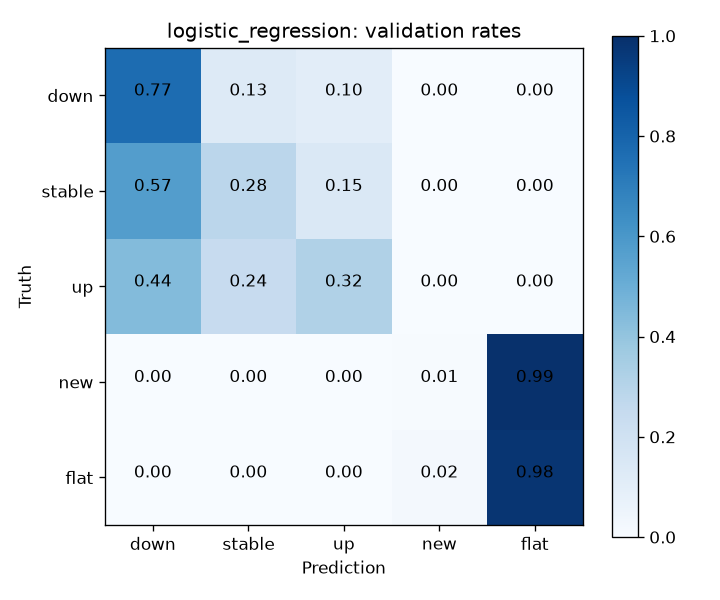
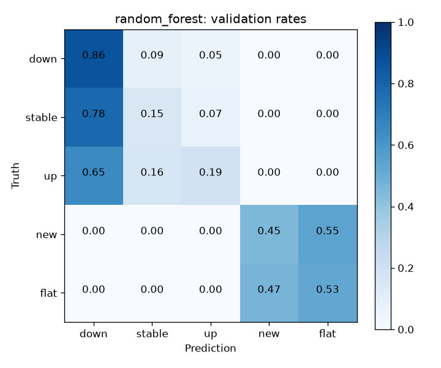

# SPEC-07 validation error analysis

no_candidate_meets_metric_requirements
Recommended model: None; development reference: random_forest. Production ready: false.

| Family | Macro F1 | Down recall | Missed down | False alerts |
| --- | ---: | ---: | ---: | ---: |
| logistic_regression | 0.389920 | 0.768068 | 706 | 1104 |
| random_forest | 0.430224 | 0.861367 | 422 | 1552 |

Paired disagreements: 1518; supported subgroup alerts: 5.
Client omission scenarios: 7; supported ordering reversal: True.

Slices overlap across dimensions; do not add their error counts. Category labels are anonymous and ordered by frequency, then value. Suppressed populations remain in subgroup_coverage.json.

Validation informed earlier feature and SPEC-06 confirmation; replay is not independent evidence.
Historical test evaluation exists; this analysis scores validation only. Final-test policy is unresolved.
Historical metadata cutoff evidence remains unresolved.
Client sensitivity is descriptive; subgroup support is not a formal privacy or fairness guarantee.
Production runtime SLA and deployment readiness are not established.

SPEC-08 handoff: decision.json binds eligibility and immutable model references. A null recommendation provides rejection evidence for research.

Future experiment hypothesis: investigate the largest off-diagonal errors using separately authorized data and cutoff evidence. No causal benefit is established.

